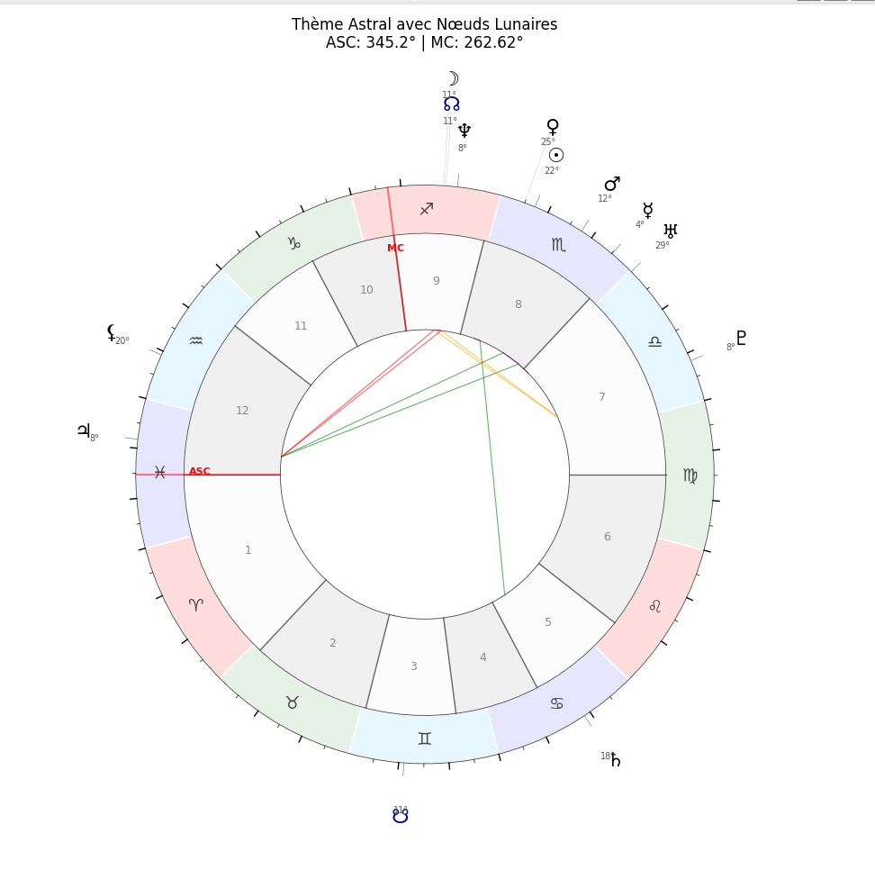

# Astro Console


**Astro Console** est un projet Python modulaire permettant d'afficher des résultats astrologiques directement dans le terminal grâce à la bibliothèque **Rich**, tout en générant une **roue astrologique** sous forme de fenêtre graphique avec **Matplotlib**.

Le projet inclut un ensemble complet de modules spécialisés (planètes, aspects, maisons, roue, tradition, etc.) ainsi qu'une suite complète de tests unitaires avec **pytest** et **pytest-cov**.

---
# Astro Console



## ✨ Fonctionnalités principales

* Affichage riche et coloré dans le terminal avec **Rich**.
* Calculs astrologiques avec **pyswisseph** et modules dédiés.
* Génération automatique d'une **roue astrologique** (Matplotlib).
* Architecture **modulaire** et facilement extensible.
* Suite de **tests unitaires complète** (pytest).
* Structure claire et organisée.

---

## 📁 Structure du projet

```
Astro_Console/
├── main.py
├── requirements.txt
├── module/
│   ├── __init__.py
│   ├── affichage.py
│   ├── aspects.py
│   ├── astrologia_tradition.py
│   ├── maisons.py
│   ├── planetes.py
│   ├── rahu_ketu.py
│   ├── roue.py
│   ├── roue_v2.py
│   ├── test_theme.py
│   └── theme.py
└── tests/
    ├── __init__.py
    ├── conftest.py
    ├── test_affichage.py
    ├── test_aspects.py
    ├── test_astrologia_tradition.py
    ├── test_maisons.py
    ├── test_planetes.py
    ├── test_rahu_ketu.py
    ├── test_roue.py
    ├── test_roue_v2.py
    ├── test_theme.py
    └── test_utils.py
```

---

## 🚀 Installation

Assurez-vous d'utiliser Python 3.10+.

1. Clonez le dépôt :

```bash
git clone https://github.com/votre-nom/Astro_Console.git
cd Astro_Console
```

2. Créez un environnement virtuel (optionnel mais recommandé) :

```bash
python -m venv env
source env/bin/activate  # Linux/macOS
env\Scripts\activate     # Windows
```


```bash
pip install -r requirements.txt
```

---

## ▶️ Lancer simplement

```bash
python main.py
```

Entrez la date et l'heure de naissance
Entrez le lieu de naissance

Ce que vous verrez :

- Une interface terminal stylée grâce à Rich.
- Une fenêtre Matplotlib affichant le thème astrologique.

---

## ▶️ Utilisation

Lancez simplement :

```bash
python main.py
```

Entrez la date et l'heure de naissance
Entrez le lieu de naissance

### Ce que vous verrez :

- Une interface terminal stylée grâce à Rich.
- Une fenêtre Matplotlib affichant le thème astrologique.

* Une interface terminal stylée grâce à **Rich**.
* Une fenêtre Matplotlib affichant le thème astrologique.

---

## 🧪 Tests

Lancer la suite complète de tests :

```bash
pytest
```

Avec le rapport de couverture :

```bash
pytest --cov=module
```

---

## 🖼️ Captures d’écran

Voici un aperçu du thème astral généré par l’application :

```markdown

```

*(Place l’image dans un dossier `images/` dans le dépôt GitHub.)*

---

## 📦 Dépendances principales

Parmi les bibliothèques utilisées :

* `rich`
* `matplotlib`
* `pyswisseph`
* `timezonefinder`
* `geopy`
* `numpy`
* `pytest`

La liste complète est disponible dans **requirements.txt**.

---

## 📜 Licence

*(À compléter — MIT recommandé)*

---

## 🙌 Contribution

Les contributions sont les bienvenues ! Vous pouvez :

* ouvrir une *issue*
* proposer une *pull request*
* suggérer des améliorations

---

## ⭐ Remerciements

Merci aux bibliothèques open-source qui rendent ce projet possible.
